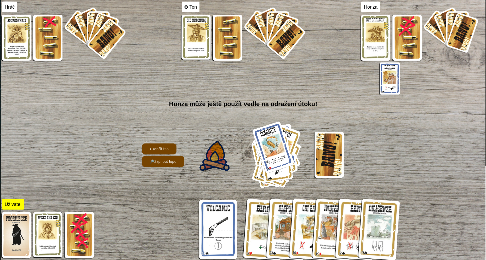

# Bang! — Síťový herní engine pro karetní hry


Univerzální engine pro hraní tahových karetních her přímo v prohlížeči. Server v Javě, klient v Reactu, hra rozšiřitelná pluginy. Aktuálně obsahuje **Bang!**, **Prší** a **UNO**.

**Hrát online:** [bang.honzaa.cz](https://bang.honzaa.cz)

**API dokumentace:** [bang.honzaa.cz/apidocs](https://bang.honzaa.cz/apidocs)

**Nahlásit chybu:** [GitHub Issues](https://github.com/honzaHlavnicka/Bang/issues)

---

<!-- SCREENSHOT: hlavní herní plocha během hry Bang! (např. 4 hráči, karty v ruce, centrální panel) -->


---

## Obsah

- [O projektu](#o-projektu)
- [Architektura](#architektura)
- [Obsažené hry](#obsažené-hry)
- [Jak hrát](#jak-hrát)
- [Spuštění vývojového prostředí](#spuštění-vývojového-prostředí)
- [Build a nasazení](#build-a-nasazení)
- [Tvorba vlastního pluginu](#tvorba-vlastního-pluginu)
- [Dokumentace](#dokumentace)
- [Plány do budoucna](#plany-do-budoucna)
- [Licence](#licence)

---

## O projektu

Bang! engine vznikl jako ročníková práce (IOČ) na Gymnáziu Arabská v Praze. Cílem bylo vytvořit platformu, kde si lze zahrát karetní hry online s přáteli — bez instalace, přímo v prohlížeči.

Architektura je navržena tak, aby **konkrétní hra nebyla součástí enginu**, ale načítala se jako nezávislý plugin. Díky tomu lze přidávat nové hry bez úpravy serverového kódu.

**Technologie:**
- **Server:** Java 11, Java WebSocket, org.json
- **Klient:** React, TypeScript, Vite, react-dnd, react-hot-toast
- **Komunikace:** WebSocket s vlastním textovým protokolem
- **Hosting:**  Školní server Avava (Gymnázium Arabská)

---

## Architektura

```
┌─────────────────────────────────────────────────┐
│                   Klient (React)                │
│  LoginPage │ GamePage │ Drag&Drop │ Dialogy     │
└───────────────────┬─────────────────────────────┘
                    │ WebSocket
┌───────────────────▼─────────────────────────────┐
│                Server (Java)                    │
│  SocketServer → KomunikatorHry → Hra            │
│                                                 │
│  ┌──────────────────────────────────────────┐   │
│  │               SDK (interface)            │   │
│  │  HerniPlugin │ HerniPravidla │ Hrac      │   │
│  └──────────┬───────────────────────────────┘   │
└─────────────┼───────────────────────────────────┘
              │ načítání za běhu (ClassLoader)
┌─────────────▼───────────────────────────────────┐
│              Pluginy (.jar)                     │
│       Bang! │ Prší │ UNO │ vlastní...           │
└─────────────────────────────────────────────────┘
```

Server načítá pluginy dynamicky ze složky `/pluginy/` při startu. Každý plugin implementuje rozhraní `HerniPlugin` a `HerniPravidla` z SDK — server o konkrétních pravidlech hry nic neví.

<!-- SCREENSHOT: diagram nebo screenshot lobby / výběru hry -->
<!-- Sem vlož obrázek:  -->

---

## Obsažené hry

| Hra | Popis | Stav |
|-----|-------|------|
| **Bang!** | Karetní hra s tematikou Divokého západu, skryté role, eliminace hráčů | ✅ Plně funkční |
| **Prší** | Česká klasika — sedmičky, esa, svrškové karty | ✅ Plně funkční |
| **UNO** | Zjednodušená verze, zatím bez `+2`, `+4` a změny směru | ⚠️ Základní verze |
| **Volná hra** | Testovací plugin bez pravidel | 🧪 Pro vývoj |

---

## Jak hrát

1. Navštiv [bang.honzaa.cz](https://bang.honzaa.cz)
2. Vyber **Vytvořit hru**, zvol hru, zadej jméno a klikni na **Vytvořit**
3. Pošli kód hry přátelům — připojí se přes **Připojit se ke hře**
4. Jakmile jsou všichni připraveni, klikni na **Spustit hru**

**Ovládání:**
- 🃏 **Zahrát kartu** — přetáhni ji na odhazovací balíček
- 🔥 **Spálit kartu** — přetáhni ji na oheň vedle balíčku
- 📋 **Vyložit kartu** — přetáhni ji nad své karty (nebo na jiného hráče)
- 📥 **Líznout kartu** — klikni na dobírací balíček

Pokud se odpojíš, stránka ti při návratu nabídne **Vrátit se do hry**.

---

## Spuštění vývojového prostředí

### Požadavky
- Java 11+
- Node.js 18+
- Maven

### 1. Server

Otevři Java projekt v IDE (např. NetBeans nebo IntelliJ) a spusť třídu `Main`.

> Pokud Maven nerozpozná závislosti, zkus v IDE použít "Reload project" nebo "Force re-import".

Nakonfiguruj `.env` v kořeni projektu:
```env
SERVER_PORT=8080
ADMIN_PASSWORD=heslo123
```

### 2. Klient

```bash
cd klient_react/bang/
```

Nakonfiguruj `.env`:
```env
VITE_SERVER_HOST=localhost
VITE_SERVER_PORT=8080
VITE_SERVER_PROTOCOL=ws
VITE_DEBUG=true
```

```bash
npm install
npm run dev
```

Klient bude dostupný na `http://localhost:5173`.

---

## Build a nasazení

### Server

```bash
# Nastav konfiguraci
cat > .env << EOF
SERVER_PORT=8080
ADMIN_PASSWORD=heslo123
EOF

# Spusť build
./build.sh

# Spusť server
cd build && bash start.sh
```

Skript vytvoří složku `build/` se zkompilovaným serverem, pluginy a spouštěcím skriptem.

### Klient (statické html)

```bash
cd klient_react/bang/
npm install --
npm run build
```

> Před buildem zkontroluj, že `.env` soubory serveru i klienta mají nastavený stejný port a doménu.

---

## Tvorba vlastního pluginu

Engine je navržen tak, aby přidání nové hry bylo co nejjednodušší. Stačí implementovat dvě rozhraní z SDK:

```java
public class MojeHra implements HerniPlugin {
    @Override
    public String getNazev() { return "Moje hra"; }

    @Override
    public HerniPravidla vytvorPravidla(Hra hra) {
        return new MojeHraPravidla(hra);
    }
    // ...
}
```

Plugin zkompiluj do `.jar` a vlož do složky `/pluginy/` — server ho načte automaticky při startu.

📖 **Podrobný návod:** [docs/tutorial/VlastniHra.md](docs/tutorial/VlastniHra.md)  
📚 **API dokumentace:** [bang.honzaa.cz/apidocs](https://bang.honzaa.cz/apidocs)

---

## Dokumentace

| Dokument | Popis |
|----------|-------|
| [Protokol (WebSocket)](docs/protocol/README.md) | Kompletní dokumentace komunikačního protokolu |
| [API dokumentace (Javadoc)](https://bang.honzaa.cz/apidocs) | Dokumentace SDK pro tvorbu pluginů |
| [Návod na vlastní plugin](docs/tutorial/VlastniHra.md) | Krok za krokem: jak napsat vlastní hru |
| [IOČ dokumentace](docs/IOC/) | Technická dokumentace ročníkové práce |

---

## Plány do budoucna

### Blízká budoucnost
- [ ] Kvarteto a Výbušná koťátka jako nové pluginy
- [ ] Rozšíření Bang! 
- [ ] Konfigurace pravidel před zahájením hry

### Výhled
- [ ] Peer-to-peer voice chat přes WebRTC + PeerJS
- [ ] Podpora pluginů v JavaScriptu / TypeScriptu (GraalVM)
- [ ] Přizpůsobení vzhledu

---


<div align="center">

Vytvořil **Jan Hlavnička** — Ročníkový projekt 2025/2026, Gymnázium Arabská, Praha 6

[bang.honzaa.cz](https://bang.honzaa.cz) · [GitHub](https://github.com/honzaHlavnicka/Bang)

</div>
